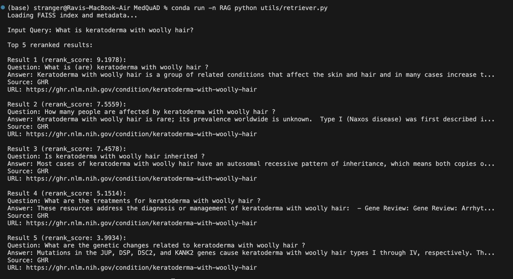
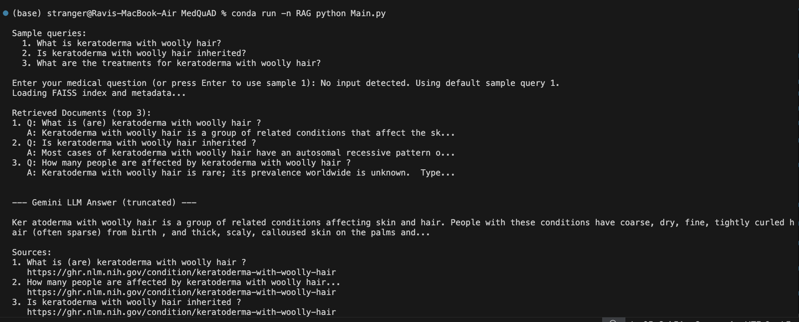
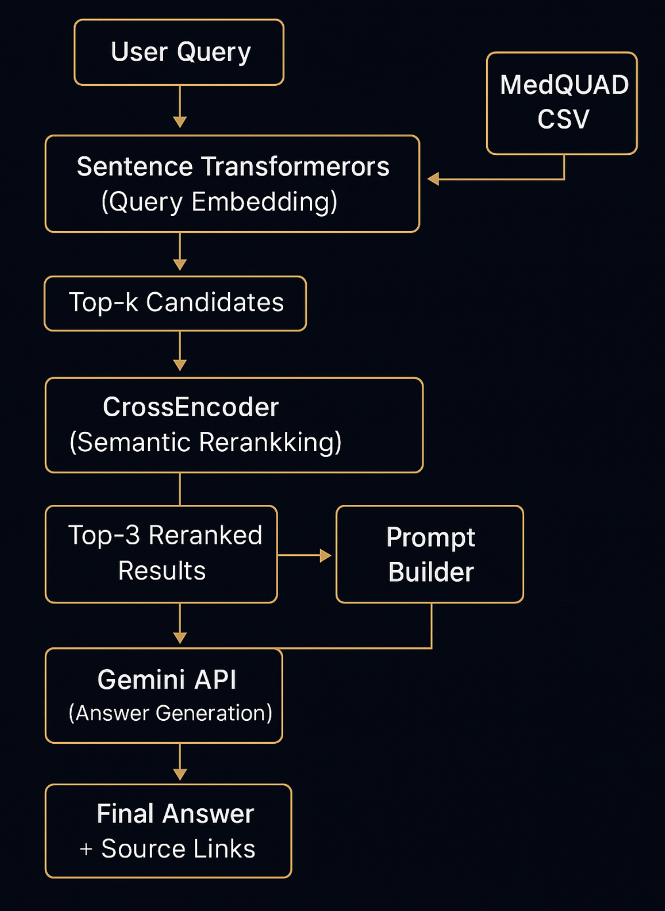

# Medical Q&A Assistant: Smart Retrieval with AI-Powered Responses

Healthcare information online can be overwhelming and unreliable. This intelligent medical assistant solves that problem by combining **Retrieval-Augmented Generation (RAG)** with the trusted **MedQuAD** medical database and **Google's Gemini AI** to deliver accurate, source-backed healthcare answers.

Engineered for **production-grade accuracy** and **clinical reliability**.

---

## 🎯 Project Goals

Traditional AI systems often fabricate medical information when uncertain — a critical safety risk.  
Our approach is fundamentally different: we **search verified medical databases**, **rank results by relevance**, and **generate responses anchored in authoritative sources**.

🔒 **Evidence-based responses only**  
🔗 **Complete source transparency**  
⚡ **Built for real-world deployment**

This demonstrates how modern RAG architectures can deliver trustworthy AI in high-stakes domains.

---

## 🗄️ Data Foundation

Our system leverages the **MedQuAD** medical knowledge base — a curated repository of authentic healthcare Q&A content from trusted institutions including **NIH**, **MedlinePlus**, and the **Genetic and Rare Diseases Information Center (GARD)**.  

The dataset undergoes thorough **preprocessing and structuring** into standardized records with:
- `question` — Original medical query
- `answer` — Expert-verified response  
- `source` — Authoritative institution
- `filename` — Document reference
- `url` — Direct source link

This foundation ensures every response traces back to **clinically validated information** rather than unverified web content.

---

## ⚙️ System Architecture

The query processing pipeline follows these sequential steps:

1. **Vector Search via FAISS**  
   → User queries are converted to embeddings and matched against our indexed medical knowledge base.

2. **Intelligent Reranking**  
   → Retrieved candidates undergo semantic reranking using CrossEncoder models for optimal relevance scoring.

3. **Context Assembly**  
   → Top-ranked results are formatted into structured prompts optimized for LLM comprehension.

4. **AI Response Generation**  
   → Gemini processes the curated context to produce natural, medically-grounded answers.

5. **Source Documentation**  
   → Every response includes complete attribution with links to original medical authorities.

---

## 🔧 Technical Stack

- **Embedding Model**: Sentence Transformers (`all-MiniLM-L6-v2`)
- **Vector Database**: FAISS for efficient similarity search
- **Reranking**: CrossEncoder (`ms-marco-MiniLM-L-6-v2`)
- **Language Model**: Google Gemini (`gemini-1.5-pro`)
- **Core Framework**: Python with pandas, pickle, and dotenv

---

## 📊 System Demonstrations

- **Search Results & Ranking**  
  _Visualization of retrieved medical Q&A pairs with semantic relevance scores._

  

- **Complete Processing Pipeline**  
  _End-to-end workflow from query input to final response with source attribution._

  

---

## 🏗️ Architecture Overview

---

## 📁 Module Structure

The codebase is organized into specialized components:

| Component | Module | Function |
|:----------|:-------|:---------|
| **Data Processing** | `data_loader.py` | Parse and structure MedQuAD medical content |
| **Vector Operations** | `embeddings.py` | Create embeddings and build searchable FAISS index |
| **Search Engine** | `retriever.py` | Execute semantic search and retrieve relevant documents |
| **Relevance Scoring** | `retriever.py` | Apply CrossEncoder reranking for precision |
| **Prompt Engineering** | `prompt_builder.py` | Construct optimized prompts for Gemini |
| **AI Integration** | `gemini_client.py` | Interface with Gemini API and process responses |
| **Application Logic** | `main.py` | Orchestrate pipeline and present final results |

---
